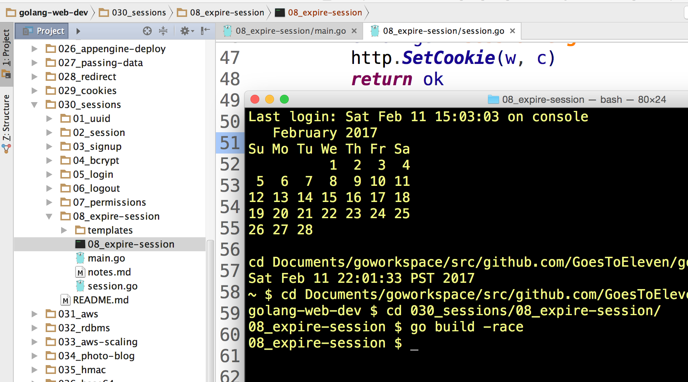
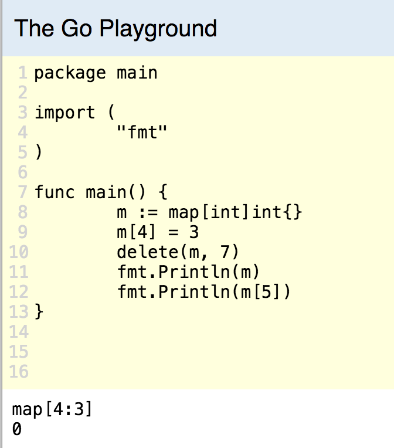

# Concurrency & Race Conditions

## Could this code cause a race condition?

```
go cleanSessions()
```

```
func cleanSessions() {
	for k, v := range dbSessions {
		if time.Now().Sub(v.lastActivity) > (time.Second * 30) {
			delete(dbSessions, k)
		}
	}
	dbSessionsCleaned = time.Now()
}

```

https://golang.org/doc/go1.6 says:

"The runtime has added lightweight, best-effort detection of concurrent misuse of maps. As always, if one goroutine is writing to a map, no other goroutine should be reading or writing the map concurrently. If the runtime detects this condition, it prints a diagnosis and crashes the program. The best way to find out more about the problem is to run the program under the race detector, which will more reliably identify the race and give more detail."

When you

```
go build -race
```

you do not get a race condition reported.



So if you're not writing to a map, you can use the map concurrently without a problem.

RE: time.Time

"A Time value can be used by multiple goroutines simultaneously."

https://godoc.org/time#Time

## Expanding on maps & goroutines

Maps are funky.

Check this out:



https://play.golang.org/p/62DF4xvPeQ

**So you can delete something that doesn't exist, and that is not a problem.**

**And you can ask for something that isn't there, and that is not a problem (gives you the zero value for the map's value).**

Deleting IS DIFFERENT from writing.

**If more than 1 goroutine tried to delete that same entry in the map: no problem.**

**And if you're reading from the map and a value isn't there: no problem.**

So why is WRITING a problem with concurrency?

The classic race condition example is two routines READING, pulling the same value, each incrementing the value, and then each WRITING the incremented value back, and the value is incremented only 1, instead of 2.

Just remember: WRITE TO MAP = concurrency considerations.
